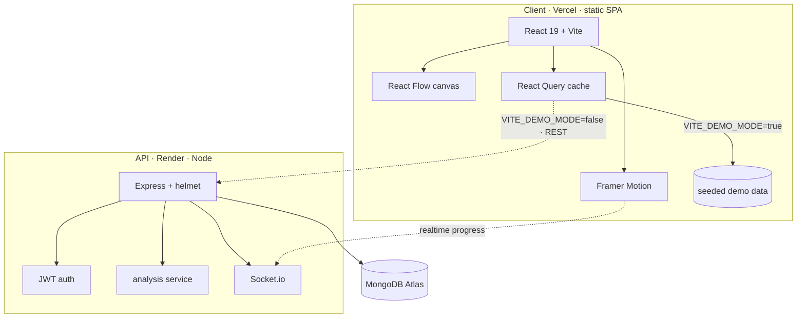

# Architecture

How Astera is put together, and why. Astera is a **demo-first SPA** with an
optional Express API — the client renders the entire product from seeded data,
and can be pointed at the live API with one env flag.



## Principles

- **Demo-first.** With `VITE_DEMO_MODE=true` (the default) the client never
  touches the network — it reads deterministic seed data. This makes the whole
  product explorable with zero backend, and keeps the UI testable in isolation.
- **Everything is a token.** Colors are CSS variables; one `data-theme` on
  `<html>` re-skins the product (chrome, charts, DNA, gauges) with no re-render.
- **Data-driven UI.** The workspace graph, replay moments, reader sections, and
  confidence breakdown are all derived from a single report shape, so a new
  report "just works" everywhere.

## Client structure

```
client/src/
├── components/
│   ├── common/     nav, palette, toasts, error boundary, empty states, mesh bg
│   ├── landing/    hero, story, how-it-works, features, pricing, footer
│   ├── workspace/  custom React Flow nodes, edges, node panel
│   ├── replay/     cinematic build + interactive replay
│   ├── report/     cover reveal, narration, feedback, confidence, review mode
│   ├── reader/     sidebar, minimap
│   ├── dna/        Meeting DNA radial
│   ├── assistant/  ASTRA orb + panel
│   └── ui/         Button, SpotlightCard, Reveal, Glyph, CountUp
├── pages/dashboard/  Workspace, Demos, Reports, Report, Reader, Replay,
│                     Analytics, Upload, Settings, Status, About
├── layouts/    app shell (desktop sidebar + mobile tab bar)
├── context/    theme · sound · a11y · interview · toast   (Provider + hook)
├── hooks/      hotkeys · magnetic · tilt · parallax · smooth-scroll · data · theme-hex
├── services/   api · reports · astra · replay · reader-content · sound · mockData
├── constants/  themes · content · demo meetings + DNA · workspace graph
└── styles/     design tokens + 3 themes
```

### Rendering & state
- **Routing:** `react-router-dom` v6 with route-level `lazy()` splitting — the
  landing bundle never pays for React Flow or Recharts.
- **Server state:** `@tanstack/react-query` wraps the reports service; in demo
  mode the query fn resolves seed data, so the same components work against real
  or seeded data.
- **UI state:** small, focused React contexts (theme, sound, accessibility,
  interview mode, toasts), each co-locating its Provider and hook.
- **Persistence:** review edits, bookmarks, sticky notes, feedback, ASTRA
  memory, and preferences persist to `localStorage`, namespaced `astera:*`.

### The workspace canvas (React Flow)
Custom `nodeTypes`/`edgeTypes` are defined **once** (module scope) for stable
identities; `nodes`/`edges` are `useMemo`'d on state to avoid remount churn. The
pipeline is described declaratively in `constants/workspace.js`, so "re-run
analysis" simply walks node statuses `idle → active → done`.

### Motion & accessibility
Framer Motion everywhere, transform/opacity only. A global `MotionConfig`
`reducedMotion` is driven by the accessibility context, so reduced-motion
settles JS animations instantly — not just CSS. Keyboard-first (⌘K palette,
`?` guide, `g`-chords), focus-visible rings, a `<main>` landmark, and a skip
link. Lighthouse accessibility: **100**.

## Server structure

```
server/src/
├── app.js         createApp() — configured Express app (testable, no listen)
├── index.js       http server + Socket.io + listen
├── config/        env (zod-validated) · db (soft-connect)
├── controllers/   auth · reports
├── services/      intelligence (transcript→report) · socket
├── models/        User · Report (mirror the client report shape)
├── routes/        REST surface
└── middleware/    asyncHandler · requireAuth · error envelope · 404
```

- **`createApp()`** builds the middleware + routes with no port binding, so
  `supertest` can exercise it directly and `index.js` can reuse it.
- **Soft DB connect.** If Mongo is unavailable the server still boots and the
  controllers take their demo/guard paths — the API stays explorable offline.
- **The analysis service** is honest: it ships a deterministic heuristic
  extractor labelled `engine: 'heuristic'` and exposes a seam
  (`llmExtract`) where Deepgram/OpenAI would plug in. It never claims an LLM ran.

## The report — one shape, many views
A report (`{ title, headline, participants, metrics, decisions, risks,
commitments, timeline, talkTime, dna, ... }`) is the single source of truth. From
it Astera derives: the workspace graph, the cinematic build, the scrubbable
replay moments (`services/replay`), the reader's prose sections
(`services/readerContent`), Meeting DNA (`components/dna`), and the confidence
breakdown (`utils/confidence`).

## Realtime
`Socket.io` rooms are keyed by user id (or `demo`). The analysis service emits
`report:stage` events as it walks the pipeline, which drives the live Upload
Studio and the workspace sweep. CORS on both HTTP and the socket is pinned to
`CLIENT_URL`.

## Trade-offs (honest)
- **JavaScript, not TypeScript** — a deliberate choice for this project; ESLint +
  tests carry the safety net a type system otherwise would.
- **Demo-mode is the shipped path.** The auth flow exists server-side and is
  tested, but the client UI ships without a login screen — see the roadmap.
