<div align="center">

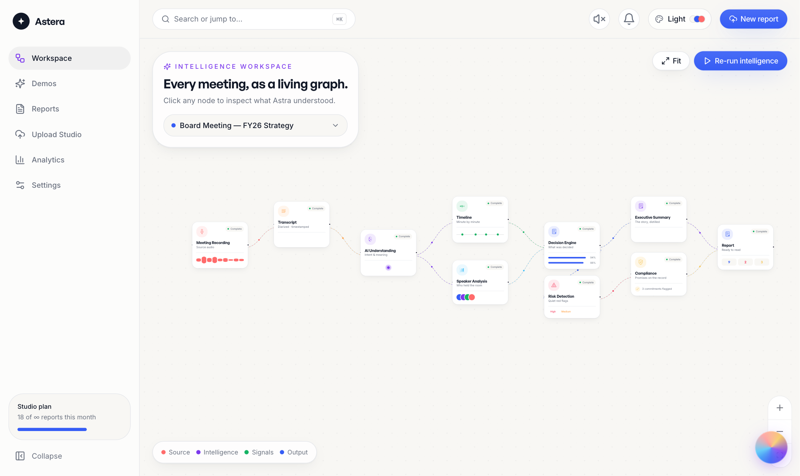

# ✦ Astera

### From Conversations to Clarity.

**Astera turns long meetings into beautiful intelligence reports — not boring PDFs.**
A living workspace, a cinematic replay, a signature Meeting DNA, and an assistant
that actually understands the room.

<p>
  
  
  
  
  
  
  
  
</p>

<p>
  <b><a href="#-quickstart">Quickstart</a></b> ·
  <b><a href="#-signature-experiences">Experiences</a></b> ·
  <b><a href="#-architecture">Architecture</a></b> ·
  <b><a href="#-the-ai-pipeline">AI Pipeline</a></b> ·
  <b><a href="#-design-decisions">Design Decisions</a></b>
</p>

</div>

---

## Why Astera exists

Every meeting holds a decision, a promise, a risk — and most of it evaporates the
moment the call ends. Note-takers capture words, not meaning. Transcripts are long
and unread. **Astera reads the _intent_ of a conversation** — what was decided, who
owns it, what's at risk — and composes it into something worth opening.

This is deliberately **not** another dark AI dashboard. It's editorial and
handcrafted: warm paper, oversized type, six full themes, motion with purpose, and
a handful of moments you remember. It should feel closer to Figma / Linear / Arc
than an admin panel.

> **Try it with nothing to upload.** The app ships with six fully-populated demo
> meetings and runs entirely in the browser — no backend required.

---

## 🚀 Quickstart

```bash
git clone https://github.com/techcodie/astera.git
cd astera

# Frontend — renders the whole product from seeded data (demo mode)
cd client
npm install
npm run dev            # → http://localhost:5173

# Backend — optional API + realtime pipeline
cd ../server
cp .env.example .env   # add MONGODB_URI + JWT_SECRET, or leave blank for demo mode
npm install
npm run dev            # → http://localhost:5050
npm run seed           # optional: seed a demo account + reports
```

To use the live API instead of seeded data, set `VITE_DEMO_MODE=false` and
`VITE_API_URL` in `client/.env`.

---

## ✨ Signature experiences

|  |  |
| --- | --- |
| **The Intelligence Workspace** — the app's home. An infinite React Flow canvas of the meeting pipeline, with fully custom nodes (each with a live mini-visual), animated edges that carry a traveling particle, and a "re-run intelligence" sweep. Click any node to inspect what Astra understood. |  |
| **Cinematic AI Replay** — the report composes itself: Astra writes the summary word by word, metrics count up, the timeline draws, and findings slide in. Then it becomes a scrubbable meeting you can move through moment by moment. | 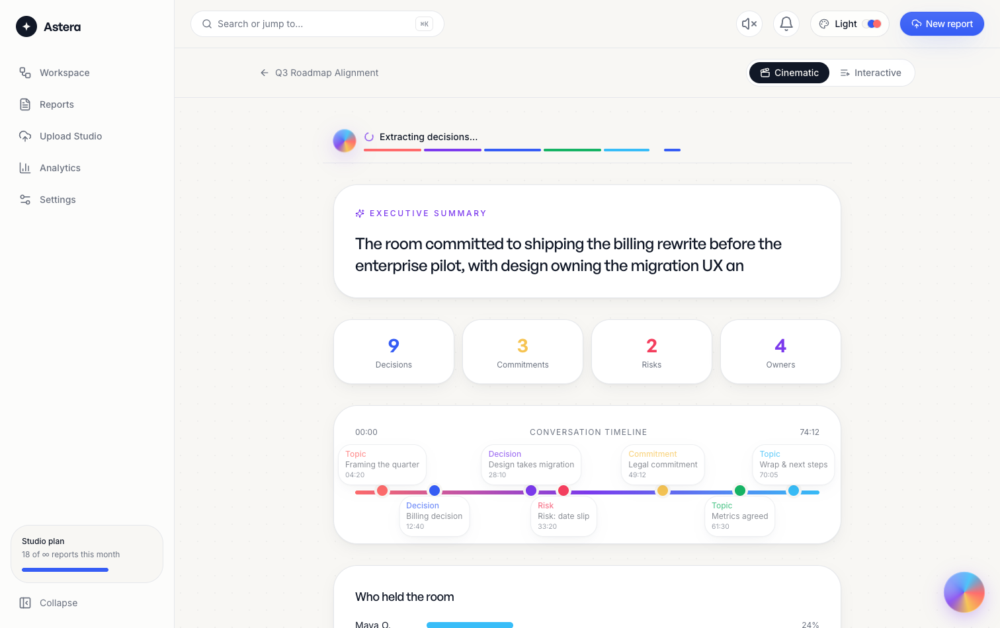 |
| **Meeting DNA** — a signature fingerprint. Six normalized traits (decision-driven, collaboration, energy, compliance, AI-confidence, conflict) plotted as an organic radial "gene shape" — unique and recognizable per meeting. | 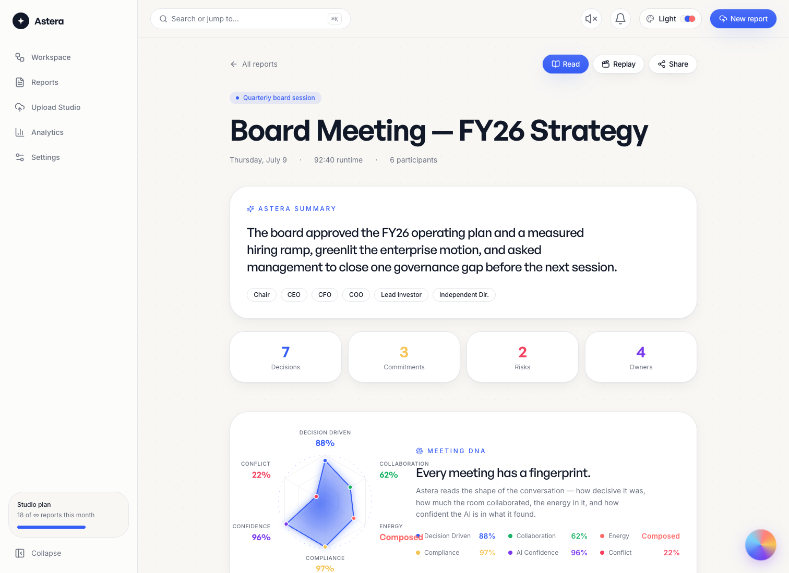 |
| **The Report Cover** — a report never opens flat. Paper assembles, the title rises word by word, an AI-confidence ring animates, and "Prepared by ASTRA" fades in before the reveal. | 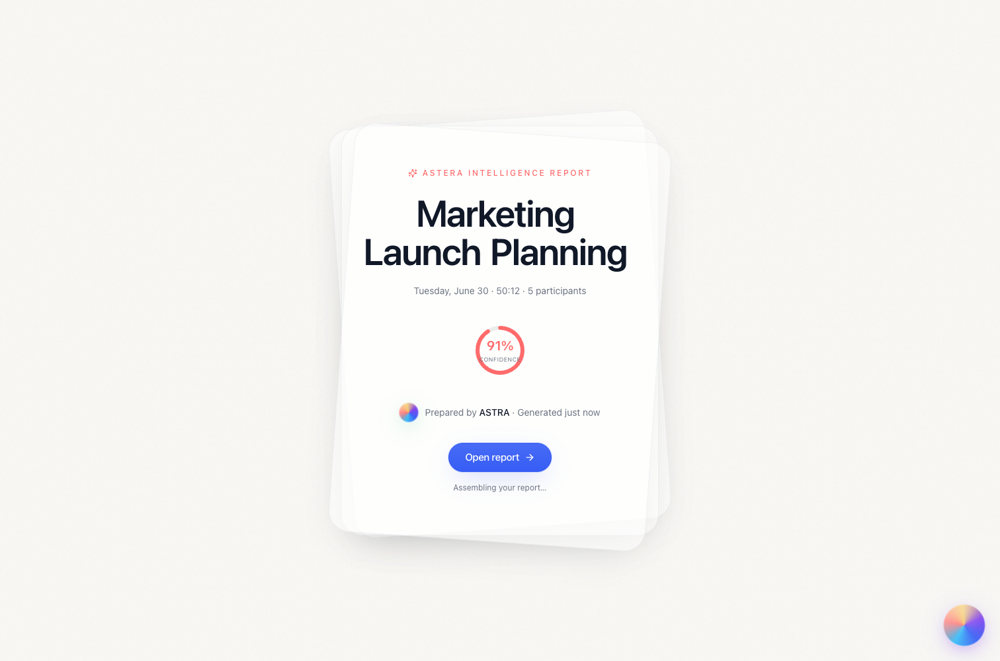 |
| **Demo Workspace** — six real meetings (Board, Fundraising, Finance, Hiring, Legal, Marketing), each explorable in seconds, no upload. | 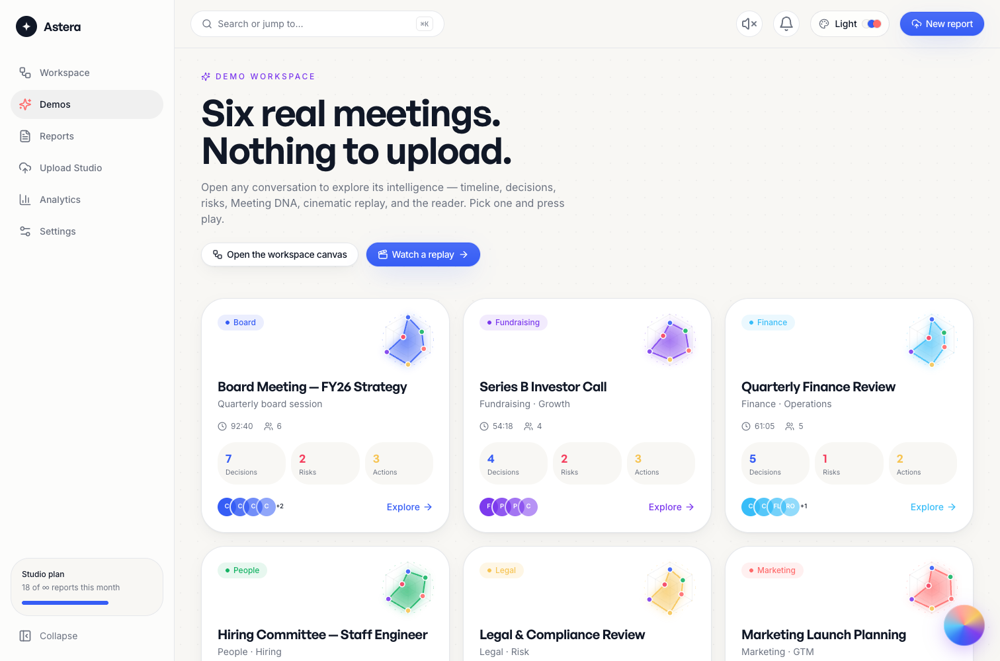 |
| **ASTRA** — a living gradient orb (not a chat box) with moods — sleeping, listening, thinking, writing, completed — that expands into an assistant grounded in the current report. | 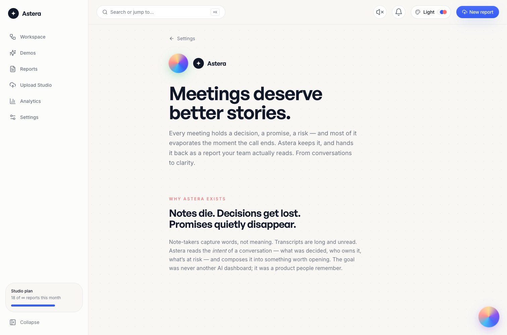 |

<details>
<summary><b>More: command palette, system status, premium reader, mobile</b></summary>

<br/>

| Command palette (⌘K) | System status | Mobile |
| --- | --- | --- |
| 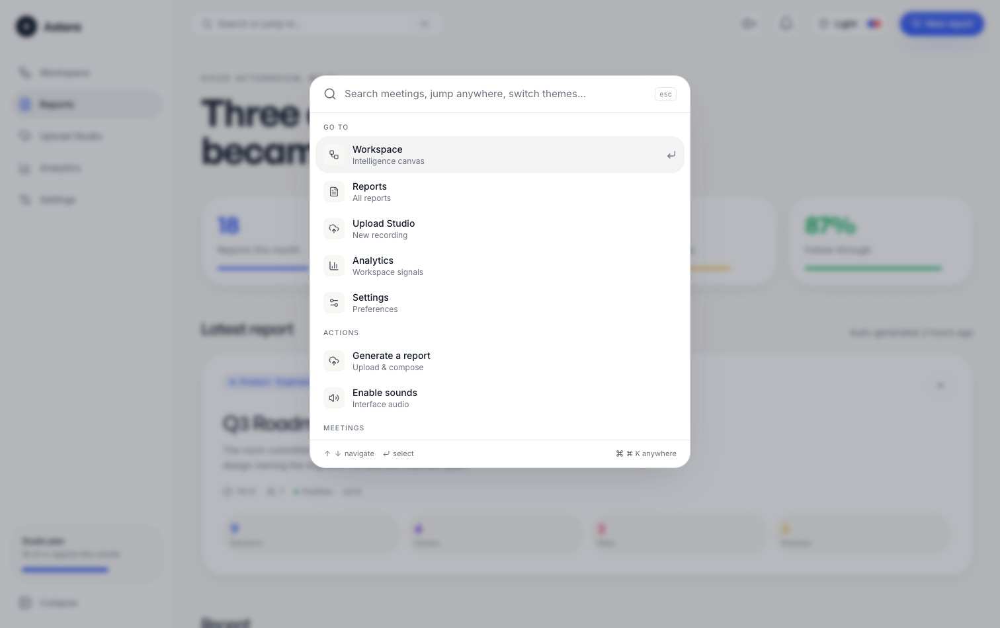 | 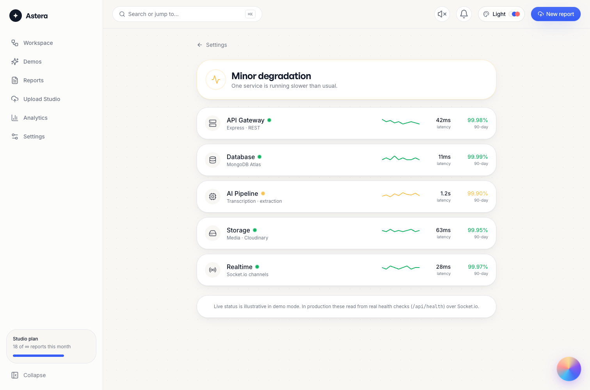 | 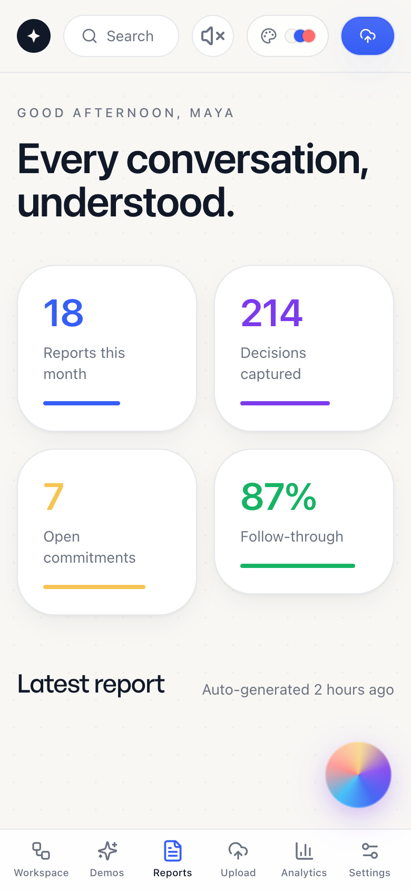 |

- **Keyboard-first** — ⌘K command palette (jump anywhere, search meetings, switch themes), a `?` shortcut guide, and `g`-chord navigation.
- **Premium Reader** — a Kindle-grade reading mode: in-report search, bookmarks, sticky notes, a document minimap, zoom, focus mode, paper texture, and hover-to-highlight.
- **First-run + guided tour** — a magical welcome and a six-step walkthrough.
- **Interview Mode** — pulsing ⓘ badges across the app that explain the engineering decisions (why React Flow, how DNA renders).
- **Easter eggs** — the Konami code rains confetti; double-click the wordmark for a paper airplane; theme changes celebrate.

</details>

---

## 🎨 Design language

- **Editorial, not admin.** Warm paper `#F8F7F4`, oversized display type, generous whitespace, magazine layouts.
- **Three exceptional themes, one switch.** Every color is a CSS variable, so a single `data-theme` on `<html>` re-skins the entire product — Light, Sunset, and a low-light Royal — including charts, Meeting DNA, and gauges. No re-render; the browser repaints from the cascade.
- **Each feature owns a color.** Reports = royal, AI = purple, timeline = emerald, compliance = golden, risks = rose, analytics = sky, upload = coral.
- **Sound, tastefully.** A synthesized Web Audio engine (zero audio assets) — muted by default, opt-in.

---

## 🧠 The AI pipeline

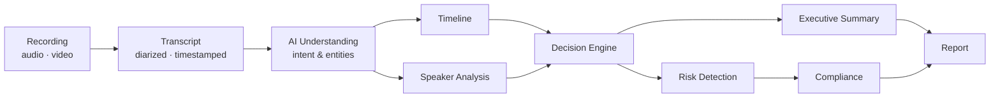

In production, transcription runs through **Deepgram** and extraction through
**OpenAI**; without keys, a deterministic heuristic extractor produces the same
report shape, so the entire pipeline is demonstrable offline. Progress streams to
the client over **Socket.io**, which is what drives the live Upload Studio and the
"re-run intelligence" sweep.

---

## 🏗 Architecture

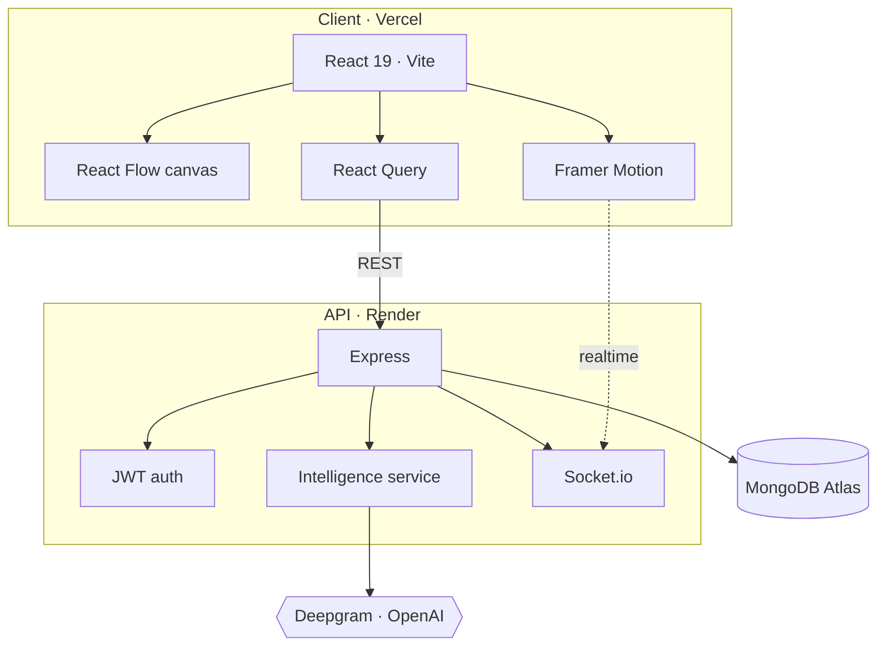

### 📁 Project structure

```
astera/
├── client/                     # React 19 + Vite
│   └── src/
│       ├── components/
│       │   ├── common/         # nav, backgrounds, palette, toasts, errors, empty states
│       │   ├── landing/        # hero, story, features, pricing
│       │   ├── workspace/      # custom React Flow nodes, edges, node panel
│       │   ├── replay/         # cinematic build + interactive replay
│       │   ├── report/         # cover reveal, timeline
│       │   ├── reader/         # sidebar, minimap
│       │   ├── dna/            # Meeting DNA radial
│       │   ├── assistant/      # ASTRA orb + panel
│       │   ├── onboarding/     # welcome + guided tour
│       │   ├── interview/      # ⓘ engineering-note badges
│       │   ├── eggs/           # confetti, paper airplane
│       │   └── ui/             # Button, SpotlightCard, Reveal, Glyph, CountUp
│       ├── pages/dashboard/    # Workspace, Demos, Reports, Report, Reader, Replay,
│       │                       #   Analytics, Upload, Settings, Status, About
│       ├── layouts/            # app shell (sidebar + mobile tab bar)
│       ├── context/            # theme · sound · a11y · interview · toast
│       ├── hooks/              # hotkeys, magnetic, tilt, parallax, smooth-scroll, data
│       ├── services/           # api · reports · intelligence · replay · astra · sound
│       ├── constants/          # themes · content · demo meetings + DNA
│       └── styles/             # design tokens + 3 themes
└── server/                     # Express API
    └── src/
        ├── controllers/  services/  models/  routes/  middleware/  config/
```

---

## ⚡ Performance

- **Route-level code splitting** — the landing bundle never pays for React Flow or Recharts.
- **Manual vendor chunks** — motion, charts, and vendor split so the hero streams fast.
- **Stable identities** — React Flow `nodeTypes`/`edgeTypes` are defined once; nodes/edges are memoized on state to avoid remount churn.
- **Cheap animations** — transform/opacity only; `AnimatePresence` for exit; no layout thrash.
- **Lazy `AudioContext`** — created on first interaction, never at load.

## ♿ Accessibility

- **Reduce motion** honors the OS setting _and_ a manual toggle that drives Framer's global `MotionConfig` (so JS-driven animations settle instantly, not just CSS ones).
- **Keyboard-first** — command palette, shortcut guide, `g`-chords, focus-visible rings, and an always-show-focus option.
- **Semantics** — a `<main>` landmark, skip-to-content link, ARIA labels on icon-only controls, and a real bottom-nav on mobile.
- **Larger-text** preference and theme contrast across all three palettes.

---

## ✅ Interaction integrity (Zero Dead UI)

Astera holds a **zero dead UI** bar: every interactive element is either
production-ready or removed — no decorative buttons, no fake loading, no
"coming soon". The full audit lives in
**[docs/INTERACTION_INVENTORY.md](docs/INTERACTION_INVENTORY.md)**.

Verified by driving the running app in a real browser across **all 13 routes,
all 3 themes, mobile, and reduced-motion** — asserting correct behavior and
**zero console errors**. The codebase carries no stray `console.*`, no
TODO/placeholder text, and no unused imports.

---

## 🧩 Design decisions

- **Why React Flow?** Pan/zoom, node measurement, and edge routing for free — but every node and edge is a custom renderer, so nothing looks default. The pipeline is data-driven, so re-running intelligence just flips node status.
- **Why CSS-variable theming?** One attribute re-skins everything with no React re-render; Tailwind tokens read `rgb(var(--x) / <alpha-value>)` so opacity compositing still works.
- **Why a heuristic AI fallback?** The whole product must be explorable with zero keys and zero backend — demo-first is a feature, not a shortcut.
- **Why synthesized sound?** No assets to download, and it can't feel off-brand — it's generated to match.
- **Why Meeting DNA?** Twenty candidates ship a dashboard. A recognizable, per-meeting fingerprint is the thing you remember.

## 🔭 Future scope

- Live transcription in the browser (WebRTC → Deepgram streaming)
- Multi-workspace + SSO/SCIM, audit log, retention controls
- Shareable public report links with granular permissions
- Slack / Google Meet / Zoom ingestion
- Vector search across every meeting ("what did we decide about pricing?")

---

## 🙏 Credits

Crafted with React, Vite, TailwindCSS, Framer Motion, GSAP, Lenis, React Flow,
React Query, Recharts, Lucide, Express, MongoDB, and the Web Audio API.

## 📄 License

[MIT](./LICENSE) — do something great with it.

<div align="center"><br/><i>Crafted, not generated.</i></div>
